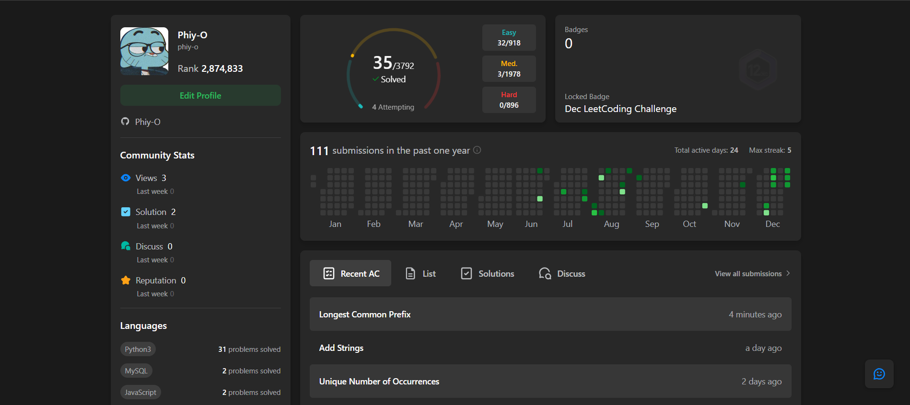

# Leetcode
🚀 LeetCode Journey

  

Repository ini berisi kumpulan solusi LeetCode yang aku kerjakan sebagai bagian dari proses belajar dan melatih problem solving, algoritma, dan logika pemrograman.
Tujuan utama repo ini bukan sekadar jawaban benar, tapi memahami cara berpikir di balik setiap solusi.

🧠 Tujuan Repository

- Melatih logika dan pola berpikir algoritmik

- Memahami time & space complexity

- Membangun kebiasaan konsisten latihan coding

- Dokumentasi progres belajar dari waktu ke waktu

🧩 Topik yang Dipelajari

Beberapa topik yang sering muncul di repo ini:
- Array & String
- Hash Map / Set
- Two Pointers
- Sliding Window
- Stack & Queue
- Recursion
- Basic Dynamic Programming
- Sorting & Searching

Fokus utama saat ini: fundamental logic & problem solving

🛠️ Bahasa Pemrograman

- Python 🐍
- JavaScript
